# react

### react란

- 사용자 인터페이스를 만들기 위한 JavaScript 라이브러리
- 사용자와 웹사이트 간에 상호작용을 돕는 인터페이스를 만들기 위한 JavaScript 기능 모음집

### 기능

- 라이브러리
  - 자주 사용되는 기능들을 정리해 모아 놓은 것
  - 문자열 관련 기능
  - 숫자관련 기능
  - 날짜 관련 기능
- 사용자 인터페이스 (User Interface, UI)
  - UI 라이브러리
    - 화면을 만들기 위한 기능들을 모아 놓은 것
    - Ngularjs(Google), React(facebook), Vue.js(SOAPLE)
- 프레임워크 vs 라이브러리
  - 프레임워크란
    - 프로그램의 흐름에 대한 제어 권한을 개발자가 아닌 프레임워크가 가지고 있다.
    - 제어 권한: 프레임워크1
  - 라이브러리란
    - 흐름에 대한 제어를 하지 않고 개발자가 필요한 부분만 필요할 때 가져가 사용하는 형태
    - 제어 권한: 개발자

### 리액트의 장점

1. 빠른 업데이트와 렌더링 속도
  - 업데이트: 화면에 나오는 내용이 변경되는 것 -> Virtual DOM, 빠른 업데이트
    - DOM: 웹 페이지를 정의하는 하나의 객체, 하나의 웹사이트에 대한 정보를 다 담고 있는 것
2. Component-Based
  - 구성요소
  - 레고 블록 조립하듯 컴포넌트들을 모아서 개발
3. 재사용성 (Reusability)
  - 다시 사용이 가능한 성질
  - 개발 기간이 단축된다.
  - 유지 보수가 용이하다.

### 리액트의 단점

1. 방대한 학습량
  - Virtual DOM, JSX, Component, State, Props
2. 지속적인 버전 업데이트
3. 높은 상태관리 복잡도

### JSX

- JavaScript(JS) + X mean A syntax extension to JavaScript => 확장 문법
- JavaScript + XML/HTML

```js
const element = <h1>Hello World</h1>;
```

#### JSX의 역할

- 내부적으로 XML/HTML 코드를 JavaScript 로 변환하는 역할
- JSX 를 사용하면 장점들이 많다.

```js
React.createElement(
  type,  // 유형, 타입 e.g) div, spen
  [props],  // 속성
  [...children]  // 자식 엘리먼트
)

class Hello extends React.Component {
  render() {
    return <div>Hello {this.props.toWhat}</div>
  }
}

ReactDOM.render(  // 실제 화면에 렌더링
  <Hello toWhat="World" />
  document.getElementById('root')
)

class Hello extends React.Component {
  render() {
    return React.createElement('div', null, `Hello ${this.props.toWhat}`);
  }
}

ReactDOM.render(  // 실제 화면에 렌더링
  React.createElement(Hello, { toWhat: 'World' }, null),
  document.getElementById('root')
)

// JSX 를 사용한 코드
const element = (
  <h1 className="greeting">
    Hello, World!
  </h1>
)

// JSX 를 사용하지 않은 코드
const element = React.createElement(
  'h1',
  { className: 'greeting' },
  'Hello, World!'
)
-> React.createElement() 의 결과로 아래와 같은 객체가 생성된다.
const element = {
  type: 'h1',
  props: {
    className: 'greeting',
    children: 'Hello, world'
  }
}
```

#### JSX의 장점

- 코드 간결
- 가독성 향상
- 버그를 발견하기 쉽다.
- Injection Attacks 방어

```js
// JSX 사용
<div>Hello, {name}</div>

// JSX 미사용
React.createElement('div', null, `Hello, ${name}`)
```

### Elements

- 어떤 물체를 구성하는 성분
- 리액트 앱을 구성하는 가장 작은 블록들
- React Elements
  - 화면에서 보이는 것들을 기술
  - 자바스크립트 객체 형태로 존재
  - 가상 DOM(Virtual DOM)에서 만들어지고, 나중에 실제 DOM 으로 변환돼서 브라우저에 표시 돼
  - 불변이기 때문에 한 번 생성되면 수정할 수 없다
    - Elements 생성 후에는 children 이나 attributes를 바꿀 수 없다
- DOM Elements
  - 브라우저에서 실제로 렌더링된 HTML 요소
  - 화면에 표시되는 HTML 태그들이 바로 DOM Element
- 흐름
  1. React 코드를 작성하면, 그 안에 있는 JSX (React Element) 가 가상 DOM 에서 관리된다.
  2. React는 변경 사항을 가상 DOM에 반영하고, 실제로 변경이 필요한 부분만 DOM Element 로 변환해서 브라우저에 업데이트 한다.

## Components와 Props의 정의

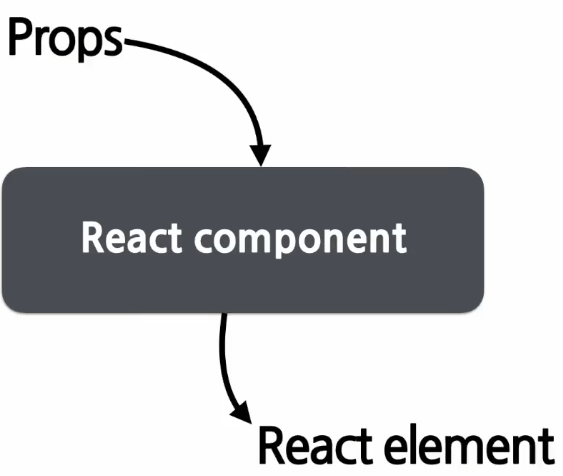

- Component-Based
  - 레고 블록 조립하듯 컴포넌트들을 모아서 개발
  - 어떤 속성(Props)들을 입력으로 받아서 그에 맞는 React Element 를 생성하여 리턴한다
- Props(Property; 속성)
  - 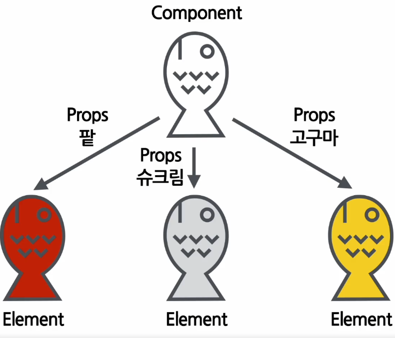
  - Component의 속성
  - 컴포넌트에 전달할 다양한 정보를 담고 있는 자바스크립트 객체
  - 같은 React Component 에서 눈에 보이는 글자나 색깔 등의 속성을 변경하고 싶을 때 사용하는 Component 의 속 재료이다
  - 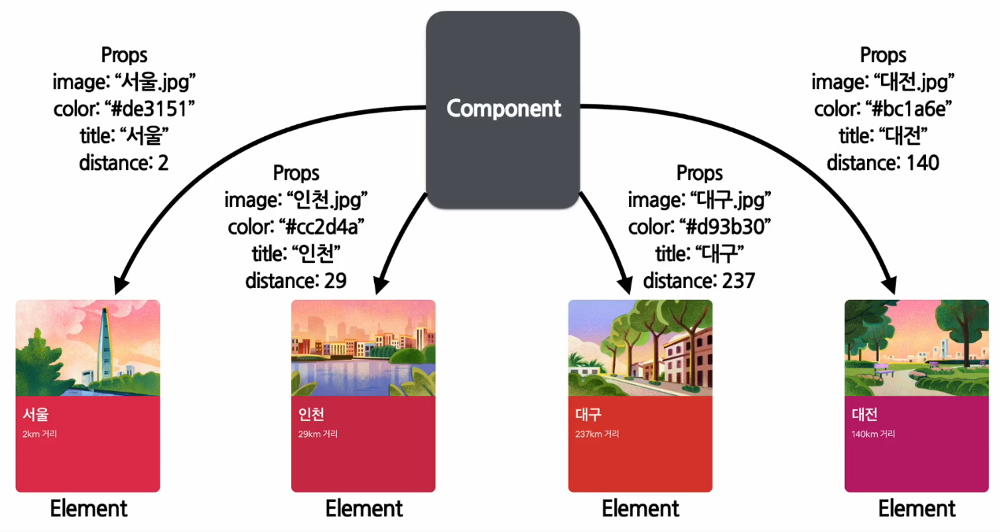

### Component 만들기

- Function Component
  ```js
  // 간단한 코드를 장점으로 가진다.
  function Welcome(props) {
    return <h1>안녕, {props.name}</h1>;
  }
  ```
- Class Component
  ```js
  class Welcome extends React.Component { // React.Component 를 상속받는다.
    render() {
      return <h1>안녕, {this.props.name}</h1>;
    }
  }
  ```

### Component의 이름

- Component 이름은 항상 대문자로 시작해야 한다. 

### Component 렌더링

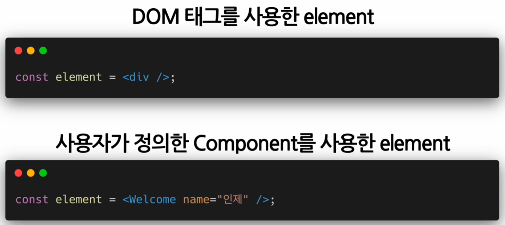

- 붕어빵 틀(Component)에서 찍어서 나온 Element 라는 붕어빵이 실제로 화면에 보인다.
- 렌더링을 위해서는 Component 로 부터 Element 를 만들어야 한다.

### Component 합성

- 여러 개의 Component 를 합쳐서 하나의 Component 를 만든다 즉 Component 안에 다른 Component를 쓸 수 있다.
- 복잡한 화면을 여러 개의 Component로 나눠서 구현 가능

```js
function Welcome(props) {
  return <h1>Hello, {props.name}</h1>;
}

function App(props) {
  return (
    <div>
    // Welcome 컴포넌트를 여러 개 사용한다. 즉 App 은 Welcome 컴포넌트를 포함하고 있다.
      <Welcome name="Mike" />
      <Welcome name="Tim" />
      <Welcome name="Jane" />
    </div>
  )
}

ReactDOM.render(
  <App />,
  document.getElementById('root')
)
```

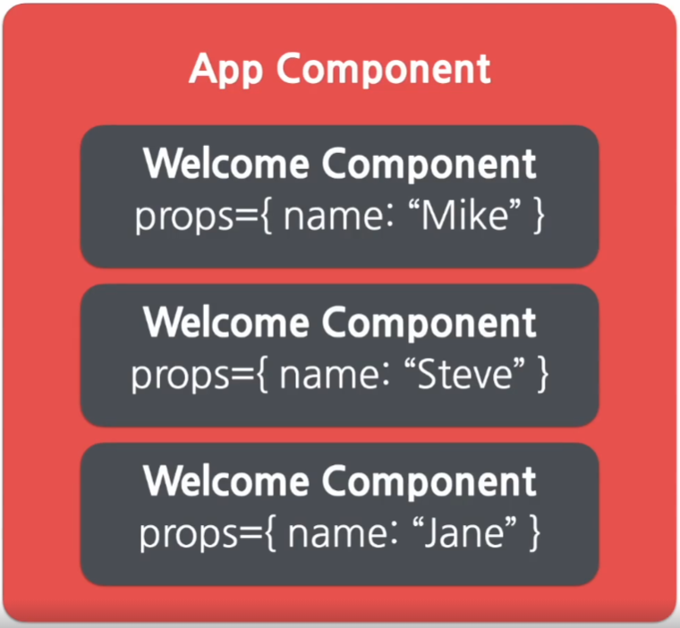

### Props의 특징

- READ ONLY; 값을 변경할 수 없다.
- 붕어빵 다 구워졌는데 속재료를 바꿀 수 없음
- 새로운 값을 Component 에 전달하여 새로 Element를 생성
- React Component 의 Props 는 변경할 수 없고, 같은 Props 가 들어오면 같은 Element를 리턴해야 한다. 

#### JavaScript 함수의 속성

```js
// 입력 값(input)을 변경하지 않으며, 같은 입력 값에 대해서는 항상 같은 출력 값을 리턴
// 모든 React Component는 그들의 Props에 관해서는 Pure 함수 같은 역할을 해야 한다.
// 모든 React Component는 Props를 직접 바꿀 수 없고, 같은 Props에 대해서는 항상 같은 결과를 보여줄 것!
function sum(a, b) {
  return a + b;
}
// 입력 값(input)을 변경
function withdraw(account, amount) {
  account.total -= amount;
}
```

### Props 사용법

```js
function App(props) {
  return (
    <Profile
        name="Tim"
        introducation="Hi my name is Tim"
        viewCount={1500}
    />
  );
}
// Props 아래와 같은 형태의 JavaScript 객체가 된다.
{
  name:"Tim",
  introduction:"Hi my name is Tim",
  viewCount: 1500
}
```

## State and Lifecycle

- State(상태) -> React Component의 상태 = React Component의 변경 가능한 데이터
- 렌더링이나 데이터 흐름에 사용되는 값만 state에 포함시켜야 함
- State는 JavaScript 객체이다

```js
// 잘못된 사용법
this.state = {
  name: 'KK'
};
// 정상적인 사용법
this.setState({
  name: 'KK'
})
```

- Lifecycle(생명주기)
- Component의 생명주기
- Component가 계속 존재하는 것이 아니라, 시간의 흐름에 따라 생성되고 업데이트 되다가 사라진다.

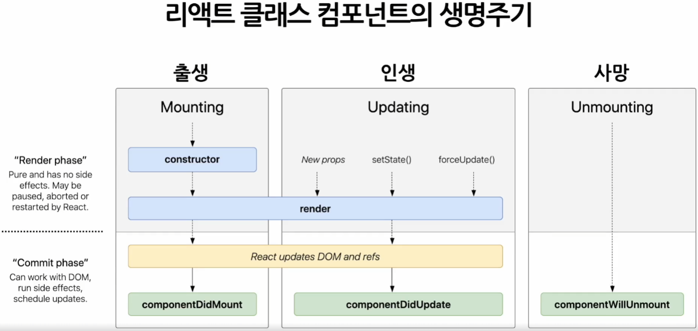

## Hooks

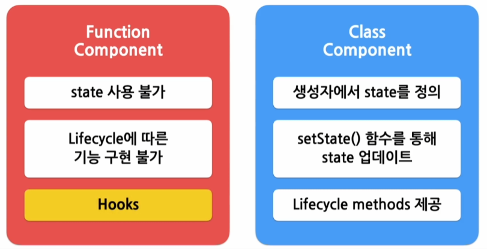

- Function Component 에서 state는 사용 불가, 따라서 Hooks 를 사용


- Function 에서 Hooks 기능
  - state 관련 함수
    - useState() -> state를 사용하기 위한 Hook
    - useEffect() -> Side effect를 수행하기 위한 Hook
      - Side effect = 효과, 영향 -> `서버에서 데이터 받아오거나 수동으로 DOM을 변경하는 작업`
        - 다른 컴포넌트에 영향을 미칠 수 있으며, 렌더링 중에는 작업이 완료될 수 없기 때문
        - React의 함수 컴포넌트에서 Side effect를 시행할 수 있게 해주는 Hook
    ```js
    // useState()
    const [변수명, set 함수명] = useState(초기값);

    import React, { useState } from "react";

    function Counter(props) {
      const [count, setCount] = useState(0);  // [변수명, set함수명] => 변수 각각에 대해 set함수가 존재

      return (
        <div>
          <p>총 {count}번 클릭했습니다.</p>
          <button onClick={() => setCount(count + 1)}>
            클릭
          </button>
        </div>
      );
    }

    // useEffect()
    useEffect(이펙트 함수, 의존성 배열);  // 이펙트가 의존하고 있는 배열 -> 배열 안에 있는 변수 중에 하나라도 값이 변경되었을 때 effect 함수가 실행
    useEffect(이펙트 함수, []);  // Effect function이 mount, unmount 시에 단 한번씩만 실행 됨
    useEffect(이펙트 함수)  // 의존성 배열을 생략하면 컴포넌트가 업데이트 될 때 마다 호출 됨

    import React, { useState, useEffect } from "react";

    function Counter(props) {
      const [count, setCount] = useState(0);  // [변수명, set함수명] => 변수 각각에 대해 set함수가 존재

      // componentDidMount, componentDidUpdate와 비슷하게 작동합니다.
      useEffect(() => {
        document.title = `You clicked ${count} times`; // 브라우저 API를 사용해서 document의 title을 업데이트 합니다.
      });

      return (
        <div>
          <p>총 {count}번 클릭했습니다.</p>
          <button onClick={() => setCount(count + 1)}>
            클릭
          </button>
        </div>
      );
    }
    ```
  - Lifecycle 관련 함수
  - 최적화 관련 함수

- useMemo() -> Memoized value 를 return 하는 Hook
  - Memoization -> 비용이 높은, 연산량이 많은 함수의 결과 값을 저장 -> 같은 입력 값은 호출하면 새로 함수를 호출하는게 아닌 이전에 저장해놨던 호출 결과를 반환
  - Cache, Memory
  ```js
  const memoizedValue = useMemo(
    () => {
      // 연산량이 높은 작업을 수행하여 결과를 반환
      return computeExpensiveValue(의존성 변수1, 의존성 변수2);
    },
    [의존성 변수1, 의존성 변수2]
  )
  // 의존성 배열을 넣지 않을 경우, 매 렌더링마다 함수가 실행 됨
  const memoizedValue = useMemo(
    () => computeExpensiveValue(a, b)
  );
  // 의존성 배열이 빈 배열일 경우, 컴포넌트 마운트 시에만 호출 됨
  const memoizedValue = useMemo(
    () => {
      return computeExpensiveValue(a, b);
    },
    []
  );
  ```

## 브라우저는 어떻게 페이지를 화면에 렌더링 할까?

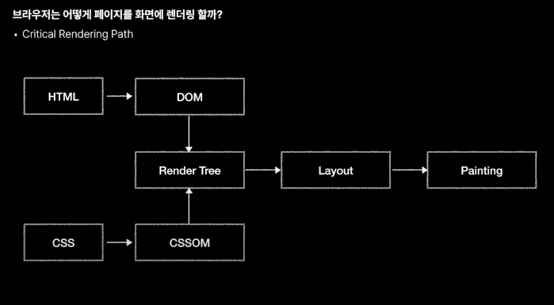

- DOM(Document Object Model) - 문서 객체 모델
  - HTML을 브라우저가 해석하기 편한 방식으로 변환한 객체 트리
    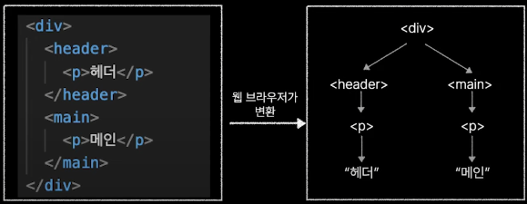
- Render Tree
  - Render Tree는 웹 페이지의 `청사진` 이라고 볼 수 있음
- Layout
  - Render Tree를 기반으로 실제 웹 페이지에 요소들의 배치를 결정하는 작업
- Painting
  - 실제로 요소들을 화면에 그려내는 과정

### 업데이트는 어떻게 이루어질까?

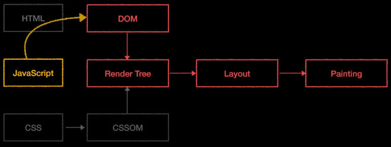

- 이벤트에 따라 화면이 실시간으로 변화하는 것 ex) 좋아요 버튼 등
- JavaScript가 DOM을 수정하면 업데이트가 발생 함
- DOM이 수정되면 Critical Rendering Path 가 다시 실행 됨
- **Layout, Painting은 매우 비싼 과정이다**
  - 비싸다는 건 연산이 많이 필요하고, 시간이 오래 걸린 다는 것
  - 잦은 Reflow, Repaint는 웹 성능 악화의 주범 
  - `Reflow` Layout을 다시 한다
  - `Repaint` Painting을 다시 한다
  - **Good Practice**
    - 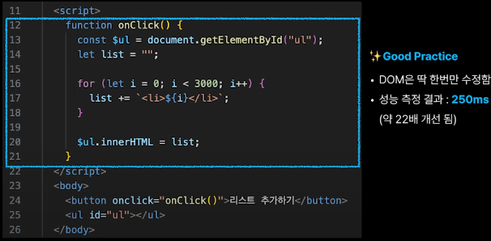
    - DOM 은 한번만 수행
- 동시에 발생한 업데이트를 모아서 한번에 수정을 해야 된다.
  - DOM 수정, Reflow, Repaint 발생 최소화
- React JS 는 내부적으로 프로그래머가 신경 쓰지 않아도 동시에 발생한 업데이트들을 모아서 최소한의 횟수로 DOM을 수정할 수 있도록 자동화를 해준다
  - 즉 추상화 되어 있고, React의 렌더링 프로세스를 사용하고 있다.

#### React의 렌더링 프로세스


- React는 2단계를 거쳐 화면에 UI를 렌더링 함
- Render Phase 1
  - 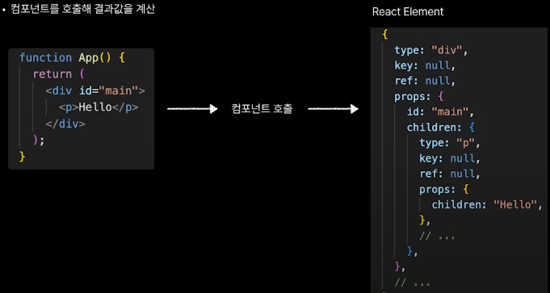
  - 즉 컴포넌트를 호출해 결과값을 계산하고 `React Element` 로 결과값이 나온다.
- Render Phase 2
  - React Element 들을 모아 Virtual DOM 생성
    - 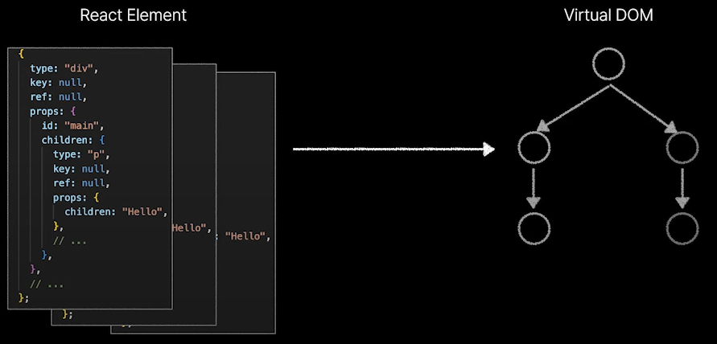
    - React Element 라고 부르는 객체 값의 모임
      - 실제 DOM은 아님 (복제판)
      - 값으로 표현된 UI (Value UI) 라고 이해하는게 더 정확함
- **React Componet -> React Element -> Virtual DOM**

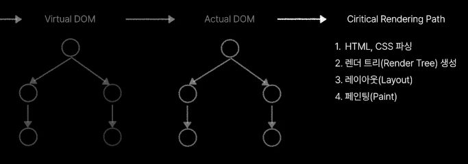

- Commit Phase
  - Virtual DOM을 Actual DOM에 반영함

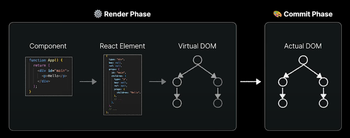

- DOM 수정을 최소화 하기 위해서 (대부분의 상황에 충분히 빠른 업데이트를 보장하기 위해서)

### 총 정리

- 순수한 JavaScript만 이용해 DOM을 조작할 때에는 DOM 수정을 최소화 해야 한다
  - Reflow, Repaint를 최소한으로 발생시키기 위함
  - 동시에 발생하는 업데이트를 최대한 모아 한번만 DOM을 수정해야 함
  - 서비스 규모가 커질수록 쉽지 않음
- React는 자체적인 렌더링 프로세스를 사용하므로 이런 걱정에서 자유로움
  - Render Phase와 Commit Phase로 나뉨
  - Render Phase에 Virtual DOM을 생성하여 동시에 발생하는 업데이트를 모음
  - Commit Phase에 Virtual DOM에 반영된 모든 업데이트를 Actual DOM에 한번만 반영함


### command

- npx create-react-app app
- npm start => 애플리케이션 실행

## Reference

- node.js v20.18.0
- https://www.youtube.com/watch?v=N7qlk_GQRJU&t=428s

